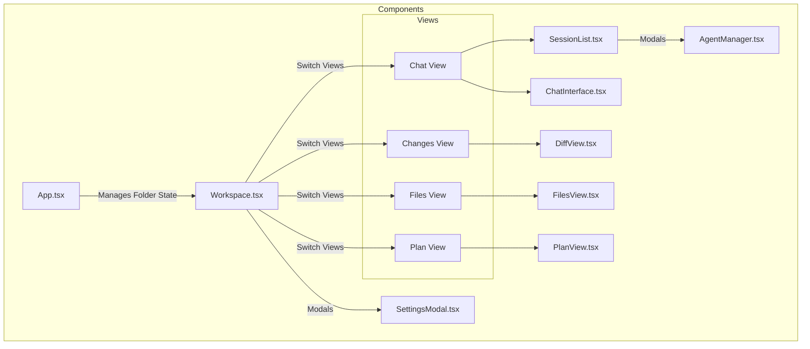
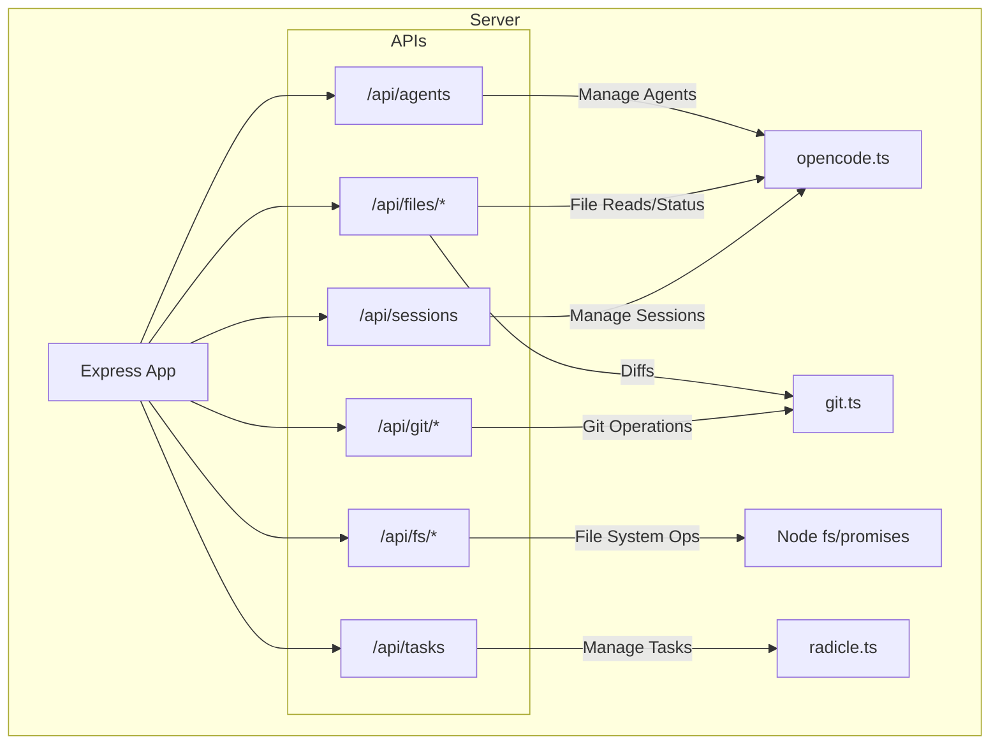

# Architecture

## Front End Architecture

The front end is built using **SolidJS** and communicates with the backend via REST APIs. It is organized into a modular structure where views and components are distinct.

## Back End Architecture

The back end is an **Express** server that acts as a bridge between the frontend and local system services (Git, File System, Opencode SDK, Radicle).

