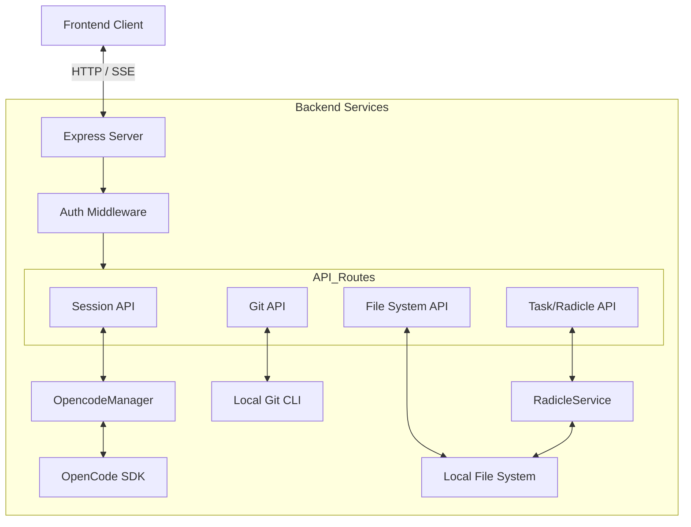
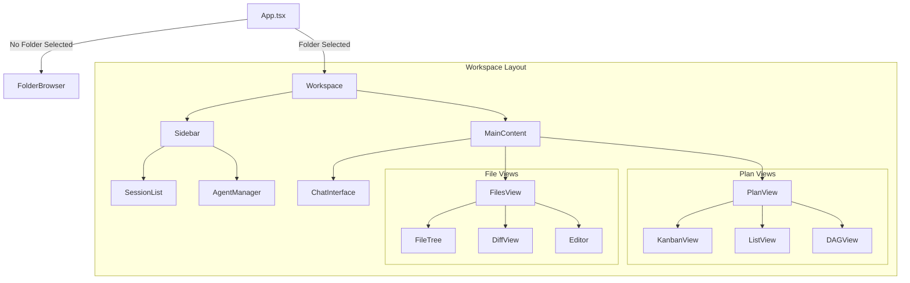

# Architecture

This document outlines the high-level architecture of the OpenCode Web UI.

## Overview

The application is a full-stack local development tool consisting of:

1.  **Frontend**: A Single Page Application (SPA) built with SolidJS and Tailwind CSS.
2.  **Backend**: An Express.js server that acts as a bridge between the frontend, the local file system, and the OpenCode SDK.

## Backend Architecture

The backend is an Express server running locally. It serves the static frontend assets and provides a REST API for system operations.

### Key Components

- **Express Server**: Handles HTTP requests and Server-Sent Events (SSE).
- **OpencodeManager**: Manages persistent connections to the OpenCode SDK for different workspaces.
- **Git Service**: Wraps local `git` CLI commands.
- **Radicle Service**: Integrates with local Radicle capabilities for task management.

### Diagram

## Frontend Architecture

The frontend is built with SolidJS, focusing on reactivity and performance.

### Key Components

- **App**: The root component that manages the global workspace state (selected folder).
- **Workspace**: The main layout container for an active session.
- **ChatInterface**: Handles real-time communication with the AI agent.
- **PlanView**: Manages project tasks and planning (Kanban, DAG, List views).
- **FilesView**: Provides file exploration and diff viewing capabilities.

### Diagram

## Data Flow

1.  **Initialization**: User selects a folder in `FolderBrowser`.
2.  **Connection**: Frontend calls `/api/connect` to initialize the `OpencodeManager` for that folder.
3.  **Interaction**:
    - **Chat**: Messages are sent to `/api/sessions/:id/prompt`. Updates are received via SSE at `/api/sessions/:id/events`.
    - **Files**: File reads/writes go through `/api/fs` or `/api/files` (which uses the SDK).
    - **Git**: Git operations are executed directly via the backend's `exec` wrappers.
