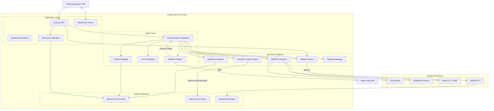
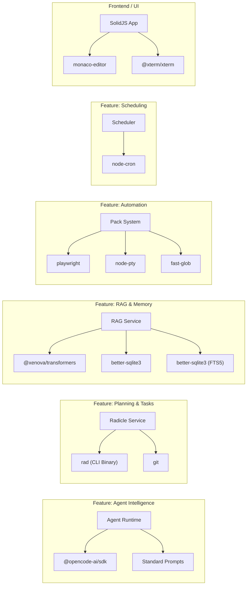

# Architecture V2: Personal OS Agent

This document details the architectural expansion of the `opencode-web-ui` system to support the "Personal OS Agent" capabilities. The new architecture integrates persistent background agent capabilities directly into the existing `opencode-web-ui` server process.

## 1. System Overview

The system operates as a **single unified process** (Node.js) that performs two concurrent roles:

1.  **UI Server**: The existing Express application serving the SolidJS frontend and handling API requests for interactive coding sessions.
2.  **Agent Runtime**: An always-on background subsystem within the same process that handles scheduling and autonomous execution.

This unified approach ensures shared access to memory, state, and file system resources without the complexity of inter-process communication or managing multiple containers.

## 2. High-Level Architecture Block Diagrams

### 2.1 System Components & Data Flow

### 2.2 Dependency & Tech Stack Map

This diagram illustrates the key third-party libraries and internal modules that power each feature.

## 3. Main Modules Detail

### 3.1 Gateway (Control Plane)

- **Role**: Entry point for internal and system events.
- **Tech**: `ws` (WebSockets), `express` (Internal Webhooks).
- **Function**:
  - **Connection**: Hosts WebSocket listeners for the UI.
  - **Routing**: Directs messages from the UI or System to specific Agent Sessions.

### 3.2 Agent Runtime & Workflow Engine

- **Role**: Orchestrates the cognitive cycle and multi-agent collaborations.
- **Tech**: `@opencode-ai/sdk`.
- **Components**:
  - **PersonalAgent**: The primary interface for the "Personal OS".
  - **WorkflowEngine**: Executes complex, multi-step agent flows (e.g., `tdd-workflow` with `worker` and `verifier` roles).
  - **State Machine**: Manages transitions between agent roles based on defined protocols (Bootstrap -> Round -> Steps).

### 3.3 Task Scheduler (Proactive Engine)

- **Role**: Initiates actions without user input based on time.
- **Tech**: `node-cron`.
- **Function**:
  - Loads job definitions from `USER/CONFIG/jobs.json`.
  - Triggers `agent_workflow` or `script` actions.
  - Supports "Wake on Event" triggers.

### 3.4 Planning & Tasks (Radicle)

- **Role**: Distributed, offline-first task and plan management.
- **Tech**: `radicle` (CLI), `git`.
- **Function**:
  - **COBs (Collaborative Objects)**: Uses Radicle's underlying object storage for Issues/Tasks.
  - **Tasks Service**: Wraps the `rad` CLI to Create/Read/Update tasks and plans.
  - **P2P Sync**: Enables syncing plans across devices without a central server.
- **Role**: Deterministic execution unit.
- **Key Packs**:
  - `pai-fs-pack`: Safe filesystem access.
  - `pai-browser-pack`: Headless browsing via `playwright`.
  - `pai-scaffold-pack`: Project templating and generation.
- **Discovery**: Dynamically loads from `USER/PACKS/`.

### 3.6 Memory Layer & RAG

- **Role**: Persistent storage and retrieval.
- **Structure**:
  - **TELOS**: `MISSION.md`, `GOALS.md` (Identity).
  - **Vector Store**: `USER/MEMORY/vectors/` (Semantic Index).
  - **Indexer**: Service that embeds workspace files and interaction logs using `all-MiniLM-L6-v2`.
  - **Retrieval**: Semantic search tools exposed to the Agent.

### 3.7 Reflection Engine

- **Role**: Automated self-improvement.
- **Process**:
  - **Analyzer**: Runs after sessions to extract "Lessons".
  - **Consolidator**: Updates `LEARNED.md` and `config.json`.
  - **Config Drift Manager**: Suggests permanent config changes based on repeated user corrections.

### 3.8 Workspace & Template Manager

- **Role**: Manages multi-project context (`~/.opencode/workspaces.json`) and scaffolding.
- **Components**:
  - **WorkspaceRegistry**: Service that tracks known projects, their paths, and last accessed time.
  - **TemplateEngine**: Uses `pai-scaffold-pack` to instantiate new projects from definitions (e.g., "React + Tailwind" stack).
  - **Global Context**: "Mounts" the user's global TELOS identity onto the active local workspace.

## 4. Integration Strategy

- **Entry Point**: The `server/src/index.ts` file will be the bootstrapper. It will start the Express HTTP server and then initialize the Agent Daemon class.
- **Unified Workspace**: The file system layout will be standardized to support the **User/System Separation**. The Repository root remains the "System", while a configurable "Data Directory" (defaulting to `~/.opencode/` or similar) will house the `USER/` data (TELOS, Memory, Packs).
- **Graceful Shutdown**: `SIGINT` handling must ensure both the HTTP server starts and the Agent saves its state/closes connections before exiting.

## 5. Deployment

- **Single Container**: The entire application is packaged as a single Docker container.
- **User Volume**: The `USER/` directory is mounted as a volume to ensure persistence and portability of the user's identity (TELOS) and memory.
